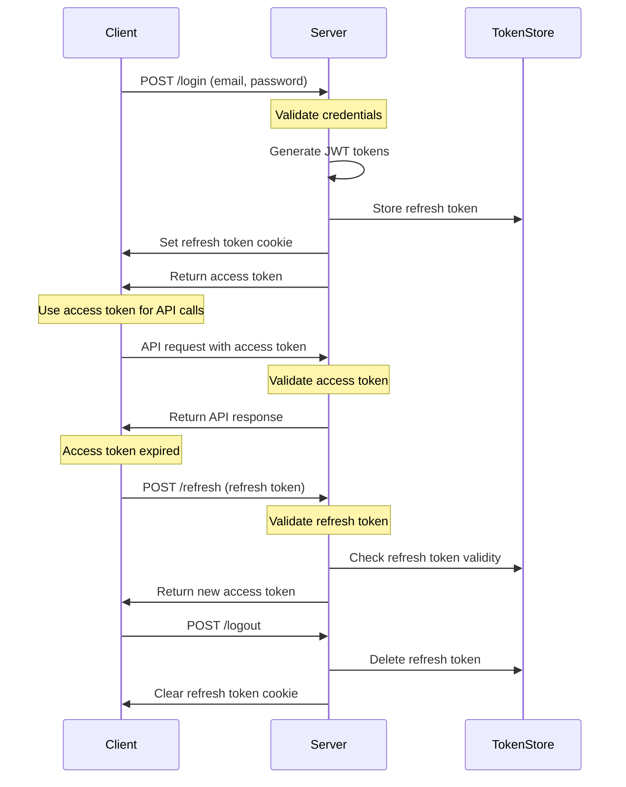
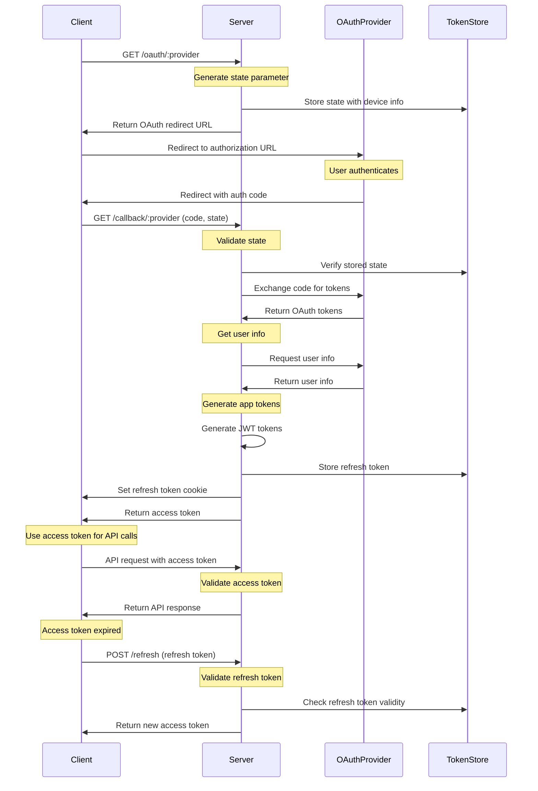

# React Node JWT Authentication Demo

A demonstration of JWT-based authentication with React frontend and Node.js backend, featuring secure token management and device-specific sessions.

## Features

- **Multiple Authentication Methods**

  - Local password authentication
  - Fake OAuth server for demoing OAuth flows:
    - Google
    - Microsoft
    - Strava
    - Company

- **Secure Token-Based Authentication**

  - JWT-based authentication with access and refresh tokens
  - HTTP-only cookies for refresh tokens
  - Device-specific session management
  - Token blacklisting for immediate invalidation

- **Token Management**

  - Short-lived access tokens (15 minutes)
  - Long-lived refresh tokens with expiration (7 days)
  - Proactive token refresh system:
    - Checks token expiration every minute
    - Refreshes tokens 5 minutes before expiration
    - Prevents race conditions from multiple simultaneous refresh attempts
    - Ensures smooth user experience without token expiration interruptions

- **Session Management**

  - Device-specific sessions
  - Session listing and management
  - Ability to revoke specific device sessions
  - Automatic cleanup of expired sessions

- **Security Features**
  - CSRF protection with SameSite cookies
  - XSS protection with HTTP-only cookies
  - Token blacklisting for immediate invalidation
  - Device tracking and management

## Authentication Flow

1. **Local Password Authentication**

   - User provides credentials
   - Client generates unique device ID and includes it in request header:
     ```
     X-Device-Id: <unique_device_id>
     ```
   - Server generates:
     - Short-lived access token (15 minutes)
     - Long-lived refresh token (7 days)
   - Refresh token stored in HTTP-only cookie
   - Access token returned to client

2. **OAuth Authentication**

   - User clicks provider-specific login button
   - Application generates unique state parameter
   - User redirected to fake OAuth server's authorization page
   - OAuth server authenticates user and requests consent
   - Server generates:
     - Short-lived access token (1 hour)
     - Long-lived refresh token (7 days)
   - Refresh token stored in HTTP-only cookie
   - Access token returned to client

3. **Access Token Usage**

   - Client stores access token in memory (not localStorage)
   - Access token included in Authorization header for all protected API requests:
     ```
     Authorization: Bearer <access_token>
     ```
   - Server validates access token on each request
   - If token is invalid or expired, client receives 401 response
   - Client-side interceptor handles token refresh on 401 responses

4. **Token Refresh**

   - Proactive refresh system:
     - Monitors token expiration continuously
     - Refreshes token 5 minutes before expiration
     - Prevents race conditions from multiple refresh attempts
     - Ensures uninterrupted user experience
   - Server validates refresh token
   - New access token issued if refresh token valid

5. **Session Management**
   - Each device gets unique refresh token
   - Sessions tracked by device ID
   - Users can view and revoke sessions
   - Expired sessions automatically cleaned up

## OAuth Implementation

The application supports OAuth 2.0 authentication with multiple providers:

- **Supported Providers**

  - Google
  - Microsoft
  - Strava
  - Custom Company Provider

- **OAuth Flow**

  1. **Authorization Request**

     - User clicks provider-specific login button
     - Application generates unique state parameter
     - User redirected to provider's authorization page
     - Provider authenticates user and requests consent

  2. **Authorization Code Exchange**

     - Provider redirects back with authorization code
     - Application exchanges code for access and refresh tokens
     - Tokens are validated and stored securely

  3. **Token Management**

     - Access tokens are short-lived (1 hour)
     - Refresh tokens are long-lived (7 days)
     - Tokens are stored securely in HTTP-only cookies
     - Automatic token refresh before expiration

  4. **Provider-Specific Scopes**
     - Google/Microsoft/Company: `openid`, `profile`, `email`
     - Strava: `read`, `activity:read`

- **Security Features**
  - State parameter to prevent CSRF attacks
  - PKCE (Proof Key for Code Exchange) support
  - Secure token storage and transmission
  - Provider-specific client validation
  - Automatic cleanup of expired authorization codes

## Security Measures

- **Access Tokens**

  - Short-lived (15 minutes)
  - Stored in memory
  - Can be blacklisted if compromised
  - Proactively refreshed to prevent expiration during use

- **Refresh Tokens**

  - Long-lived (7 days)
  - Stored in HTTP-only cookies
  - Device-specific
  - Automatically expire

- **Cookies**
  - HTTP-only (prevents XSS)
  - SameSite=strict (prevents CSRF)
  - Secure in production

## Authentication Flow Diagrams

### Password-Based Authentication Flow



### OAuth-Based Authentication Flow



## Environment Variables

### Backend

```env
PORT=3001
JWT_ACCESS_SECRET=your_access_secret
JWT_REFRESH_SECRET=your_refresh_secret
ACCESS_TOKEN_EXPIRY=900        # 15 minutes in seconds
REFRESH_TOKEN_EXPIRY=604800    # 7 days in seconds
NODE_ENV=development
```

## Getting Started

1. **Clone the repository**

   ```bash
   git clone https://github.com/yourusername/react-node-jwt-example.git
   cd react-node-jwt-example
   ```

2. **Install dependencies**

   ```bash
   # Install all dependencies (backend, frontend, oauth-server)
   npm run install:all
   ```

3. **Set up environment variables**

   The `.env` file is already included in the backend directory with the following configuration:

   ```env
   PORT=3001
   JWT_ACCESS_SECRET=your_access_secret
   JWT_REFRESH_SECRET=your_refresh_secret
   ACCESS_TOKEN_EXPIRY=900        # 15 minutes in seconds
   REFRESH_TOKEN_EXPIRY=604800    # 7 days in seconds
   NODE_ENV=development
   ```

4. **Start the development servers**

   From the root directory, run:

   ```bash
   # Start both backend and frontend servers
   npm run dev
   ```

5. **Access the application**

   - Frontend: http://localhost:5173
   - Backend API: http://localhost:3001/api
   - OAuth Server: http://localhost:3002

6. **Test the authentication**

   - Try logging in with email/password
   - Verify token refresh functionality
   - Check session management features

7. **Test OAuth authentication**
   - Start the fake OAuth server:
     ```bash
     cd oauth-server
     npm run dev
     ```
   - Try logging in with each OAuth provider:
     - Google
     - Microsoft
     - Strava
     - Company
   - Verify OAuth token refresh functionality
   - Check OAuth session management

## Troubleshooting

If you encounter issues:

1. **Authentication Issues**

   - Verify environment variables are set correctly
   - Check token expiration times
   - Ensure proper CORS configuration

2. **Token Refresh Issues**

   - Verify token expiration times
   - Check HTTP-only cookie settings
   - Ensure proper CORS configuration

3. **Session Management Problems**
   - Verify device ID generation
   - Check session storage implementation
   - Ensure proper cleanup of expired sessions

## API Endpoints

### Authentication

- `POST /auth/login` - User login
- `POST /auth/refresh` - Refresh access token
- `POST /auth/logout` - Logout user
- `POST /auth/invalidate-token` - Invalidate current access token

### Session Management

- `GET /auth/sessions` - Get active sessions
- `POST /auth/sessions/revoke` - Revoke specific session

### Users

- `GET /users/list` - Get list of users (protected)

## Security Considerations

1. **Token Storage**

   - Access tokens stored in memory
   - Refresh tokens in HTTP-only cookies
   - No sensitive data in localStorage

2. **Token Expiration**

   - Access tokens: 15 minutes
   - Refresh tokens: 7 days
   - Automatic cleanup of expired tokens
   - Proactive refresh 5 minutes before expiration

3. **Device Management**

   - Each device gets unique refresh token
   - Sessions can be monitored and revoked
   - Device information tracked for security

4. **Error Handling**
   - Proper error messages for security events
   - Graceful handling of token expiration
   - Secure error responses

## Project Structure

```
.
├── backend/               # Node.js backend
│   ├── src/
│   │   ├── routes/        # API routes
│   │   ├── middleware/    # Authentication middleware
│   │   ├── stores/        # In-memory token stores
│   │   └── server.js      # Express server setup
│   └── package.json
│
├── frontend/              # React frontend
│   ├── src/
│   │   ├── api/           # API client and services
│   │   ├── components/    # React components
│   │   ├── context/       # React context providers
│   │   └── App.tsx        # Main application component
│   └── package.json
│
├── oauth-server/          # Fake OAuth server for demoing
│   ├── src/
│   │   ├── routes/        # OAuth routes
│   │   ├── config/        # OAuth configuration
│   │   └── server.js      # OAuth server setup
│   └── package.json
│
└── package.json           # Root package.json with shared scripts
```

## Contributing

1. Fork the repository
2. Create your feature branch
3. Commit your changes
4. Push to the branch
5. Create a new Pull Request

## License

This project is licensed under the MIT License - see the LICENSE file for details.
