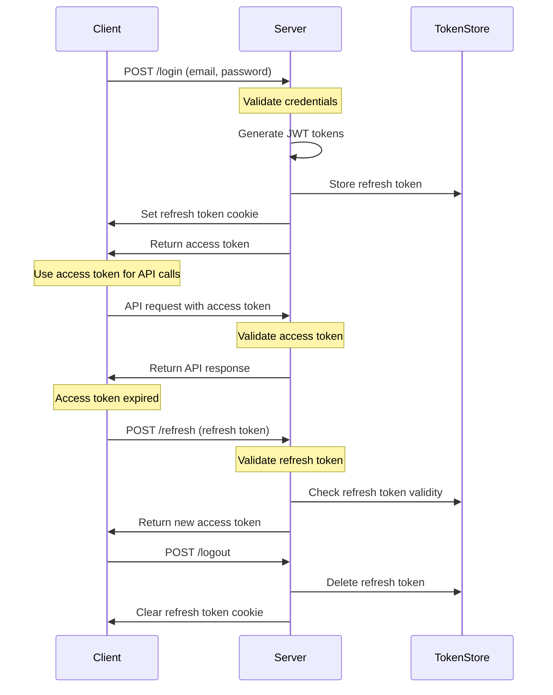
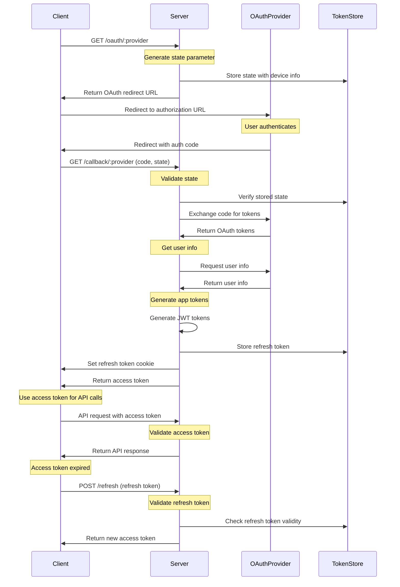

# 🔐 React Node JWT Authentication Demo

A demonstration of JWT-based authentication with React frontend and Node.js backend, featuring secure token management and device-specific sessions.

## ✨ Features

- **Multiple Authentication Methods**
  - Local password authentication
  - Fake OAuth server for demoing OAuth flows:
    - Google
    - Microsoft
    - Strava
    - Company

- **Secure Token-Based Authentication**
  - JWT-based authentication with access and refresh tokens
  - HTTP-only cookies for refresh tokens (disabled in demo)
  - Device-specific session management
  - Token blacklisting for immediate invalidation
  - Enhanced JWT claims for improved security:
    - `iss` (Issuer): Identifies the application
    - `sub` (Subject): User ID in standard JWT format
    - `aud` (Audience): Specifies authorized services
    - `jti` (JWT ID): Unique token identifier to prevent replay attacks
    - `scope`: Defines token permissions (read/write for access token, refresh for refresh token)
    - `version`: Handles token format changes
    - `deviceId`: Tracks device-specific tokens

- **Token Management**
  - Short-lived access tokens (15 seconds for demo)
  - Long-lived refresh tokens with expiration (7 days)
  - Single-use refresh tokens for enhanced security
  - Token rotation on refresh
  - ID tokens for identity verification and nonce validation
  - Proactive token refresh system:
    - Checks token expiration every minute
    - Refreshes tokens 5 minutes before expiration
    - Prevents race conditions from multiple simultaneous refresh attempts
    - Ensures smooth user experience without token expiration interruptions

- **Session Management**
  - Virtual sessions maintained through a chain of single-use refresh tokens
  - Each session is identified by a device ID and maintained through token rotation
  - Session listing and management through tracking active device IDs
  - Ability to revoke specific device sessions by invalidating all tokens for that device
  - Automatic cleanup of expired tokens

- **Security Features**
  - CSRF protection with SameSite cookies
  - XSS protection with HTTP-only cookies (disabled in demo for easier debugging)
  - Token blacklisting for immediate invalidation
  - Device tracking and management
  - Standard JWT claims for improved security
  - Permission-based token scoping
  - Replay attack prevention through unique token IDs
  - Version control for token format changes

## 🔄 Authentication Flow

1. **Local Password Authentication**
   - User provides credentials
   - Client generates unique device ID and includes it in request header:
     ```
     X-Device-Id: <unique_device_id>
     ```
   - Server generates:
     - Short-lived access token (15 seconds) with enhanced claims
     - Long-lived refresh token (7 days) with similar claims but restricted scope
   - Refresh token stored in HTTP-only cookie
   - Access token returned to client
   - Each refresh token represents a virtual session for that device

2. **Token Refresh Flow**
   - Client detects access token expiration
   - Client sends refresh token in HTTP-only cookie
   - Server validates refresh token:
     - Verifies JWT signature
     - Checks token is not revoked or used
     - Validates device ID
   - Server generates new tokens:
     - New access token
     - New refresh token (single-use)
   - Server marks old refresh token as used
   - Server stores new refresh token
   - Server sets new refresh token in HTTP-only cookie
   - Server returns new access token

3. **OAuth Authentication**
   - User clicks provider-specific login button
   - Application generates unique state parameter and nonce
   - User redirected to fake OAuth server's authorization page
   - OAuth server authenticates user and requests consent
   - Server generates:
     - Short-lived access token (1 hour) for API access
     - Long-lived refresh token (7 days) for token refresh
     - ID token containing:
       - Standard OpenID Connect claims (iss, sub, aud, exp, iat)
       - Nonce for replay attack prevention
       - Provider information
   - Refresh token stored in HTTP-only cookie
   - Access token and ID token returned to client

4. **Access Token Usage**
   - Client stores access token in memory (not localStorage)
   - Access token included in Authorization header for all protected API requests:
     ```
     Authorization: Bearer <access_token>
     ```
   - Server validates access token on each request
   - If token is invalid or expired, client receives 401 response
   - Client-side interceptor handles token refresh on 401 responses

5. **Session Management**
   - Virtual sessions are maintained through a chain of single-use refresh tokens
   - Each session is identified by a device ID and persists through token rotation
   - User can view active sessions by listing devices with valid token chains
   - User can revoke specific sessions by invalidating all tokens for a device
   - System automatically cleans up expired tokens
   - System tracks device information for each token chain
   - No traditional server-side session storage is used

## 🌐 OAuth Implementation

The application implements OAuth 2.0 Authorization Code Flow with OpenID Connect for identity verification.

- **Supported Providers**
  - Google
  - Microsoft
  - Strava
  - Custom Company Provider

- **OAuth 2.0 Authorization Code Flow with OpenID Connect**
  1. **Authorization Request**
     - Client generates:
       - State parameter (CSRF protection)
       - Nonce (replay attack prevention)
     - User redirected to provider's authorization endpoint with:
       - `response_type=code`
       - `client_id`
       - `redirect_uri`
       - `scope`
       - `state`
       - `nonce`
       - `provider`

  2. **Authorization Code Exchange**
     - Provider redirects back with:
       - Authorization code
       - State parameter
     - Client exchanges code for tokens using:
       - Authorization code
       - Client credentials
       - Redirect URI

  3. **Token Management**
     - Access tokens (15 seconds for demo)
       - Used for API access
       - Contains minimal claims (sub, provider)
     - Refresh tokens (7 days lifetime)
       - Used for obtaining new access tokens
       - Contains minimal claims (sub, provider)
     - ID tokens (15 seconds for demo)
       - Contains identity information
       - Includes nonce for replay attack prevention
       - Standard OpenID Connect claims:
         - `iss` (Issuer)
         - `sub` (Subject)
         - `aud` (Audience)
         - `exp` (Expiration)
         - `iat` (Issued At)
         - `nonce` (Nonce)
     - Secure storage in HTTP-only cookies
     - Automatic token refresh before expiration

  4. **Provider-Specific Scopes**
     - Google/Microsoft/Company: `openid`, `profile`, `email`
     - Strava: `read`, `activity:read`

- **Security Features**
  - State parameter for CSRF protection
  - Nonce in ID token for replay attack prevention
  - HTTP-only cookies for token storage
  - SameSite=strict cookie attributes
  - Secure token transmission
  - Provider-specific client validation
  - Automatic cleanup of expired authorization codes

## 🛡️ Security Measures

- **Access Tokens**
  - Short-lived (15 seconds for demo)
  - Stored in memory
  - Can be blacklisted if compromised
  - Proactively refreshed to prevent expiration during use

- **Refresh Tokens**
  - Long-lived (7 days)
  - Stored in HTTP-only cookies
  - Device-specific
  - Automatically expire

- **ID Tokens**
  - Short-lived (1 hour)
  - Contains identity information
  - Includes nonce for replay attack prevention
  - Standard OpenID Connect claims
  - Used for identity verification

- **Cookies**
  - HTTP-only (prevents XSS)
  - SameSite=strict (prevents CSRF)
  - Secure in production

## 📊 Authentication Flow Diagrams

### Password-Based Authentication Flow



### OAuth-Based Authentication Flow



## 🚀 Getting Started

1. **Clone the repository**

   ```bash
   git clone https://github.com/yourusername/react-node-jwt-example.git
   cd react-node-jwt-example
   ```

2. **Install dependencies**

   ```bash
   # Install all dependencies (backend, frontend, oauth-server)
   npm run install:all
   ```

3. **Set up environment variables**

   **Backend Configuration** - The `.env` file is already included in the backend directory:

   ```env
   PORT=3001
   JWT_ACCESS_SECRET=your_access_secret
   JWT_REFRESH_SECRET=your_refresh_secret
   ACCESS_TOKEN_EXPIRY=15         # 15 seconds for demo
   REFRESH_TOKEN_EXPIRY=604800    # 7 days in seconds
   NODE_ENV=development
   ```

   **OAuth Server Configuration** - The OAuth server uses default values but supports these environment variables:

   ```env
   PORT=3002
   JWT_SECRET=fake-oauth-secret
   ACCESS_TOKEN_EXPIRY=3600       # 1 hour in seconds
   REFRESH_TOKEN_EXPIRY=604800    # 7 days in seconds

   # OAuth Provider Configuration (optional - defaults provided)
   GOOGLE_CLIENT_ID=fake-google-client-id
   GOOGLE_CLIENT_SECRET=fake-google-client-secret
   MICROSOFT_CLIENT_ID=fake-microsoft-client-id
   MICROSOFT_CLIENT_SECRET=fake-microsoft-client-secret
   STRAVA_CLIENT_ID=fake-strava-client-id
   STRAVA_CLIENT_SECRET=fake-strava-client-secret
   COMPANY_CLIENT_ID=fake-company-client-id
   COMPANY_CLIENT_SECRET=fake-company-client-secret
   ```

4. **Start the development servers**

   From the root directory, run:

   ```bash
   # Start both backend and frontend servers
   npm run dev
   ```

5. **Access the application**
   - Frontend: http://localhost:5173
   - Backend API: http://localhost:3001/api
   - OAuth Server: http://localhost:3002

6. **Test the authentication**

   **Default Demo Credentials:**
   - Username: `demo`
   - Password: `password123`

   - Try logging in with the demo credentials above
   - Verify token refresh functionality
   - Check session management features

7. **Test OAuth authentication**
   - Start the fake OAuth server:
     ```bash
     cd oauth-server
     npm run dev
     ```
   - Try logging in with each OAuth provider:
     - Google
     - Microsoft
     - Strava
     - Company
   - Verify OAuth token refresh functionality
   - Check OAuth session management

## Debugging

For comprehensive debugging information including VS Code configurations and educational debugging with breakpoints, see the [Debugging Guide](DEBUGGING.md).

## 📡 API Endpoints

### Authentication

- `POST /api/auth/login` - User login
- `POST /api/auth/refresh` - Refresh access token
- `POST /api/auth/logout` - Logout user
- `POST /api/auth/invalidate-token` - Invalidate current access token

### OAuth Authentication

- `GET /api/auth/oauth/:provider` - Start OAuth flow (provider: google, microsoft, strava, company)
- `GET /api/auth/callback/:provider` - OAuth callback handler

### Session Management

- `GET /api/sessions` - Get active sessions
- `POST /api/sessions/revoke` - Revoke specific session

### Users

- `GET /api/users/list` - Get list of users (protected)
- `GET /api/users/profile` - Get current user profile (protected)

## 🔗 OAuth Server API Endpoints

The fake OAuth server (runs on port 3002) provides the following endpoints:

### Authorization

- `GET /oauth/authorize` - OAuth authorization endpoint
  - Parameters: `response_type`, `client_id`, `redirect_uri`, `scope`, `state`, `nonce`, `provider`
  - Returns: Authorization page or redirects with authorization code
- `POST /oauth/authorize/confirm` - Confirm authorization
  - Body: Same parameters as above
  - Returns: Redirect to callback URL with authorization code

### Token Management

- `POST /oauth/token` - Exchange authorization code for tokens
  - Body: `grant_type`, `code`, `redirect_uri`, `client_id`, `client_secret`, `provider`
  - Returns: `access_token`, `refresh_token`, `id_token`, `token_type`, `expires_in`

### User Information

- `GET /oauth/userinfo` - Get user information
  - Headers: `Authorization: Bearer <access_token>`
  - Returns: User profile information based on provider

## 📁 Project Structure

```
.
├── backend/               # Node.js backend
│   ├── src/
│   │   ├── routes/        # API routes
│   │   ├── middleware/    # Authentication middleware
│   │   ├── stores/        # In-memory token stores
│   │   └── server.js      # Express server setup
│   └── package.json
│
├── frontend/              # React frontend
│   ├── src/
│   │   ├── api/           # API client and services
│   │   ├── components/    # React components
│   │   ├── context/       # React context providers
│   │   └── App.tsx        # Main application component
│   └── package.json
│
├── oauth-server/          # Fake OAuth server for demoing
│   ├── src/
│   │   ├── routes/        # OAuth routes
│   │   ├── config/        # OAuth configuration
│   │   └── server.js      # OAuth server setup
│   └── package.json
│
└── package.json           # Root package.json with shared scripts
```

## Contributing

1. Fork the repository
2. Create your feature branch
3. Commit your changes
4. Push to the branch
5. Create a new Pull Request

## License

This project is licensed under the MIT License - see the LICENSE file for details.
