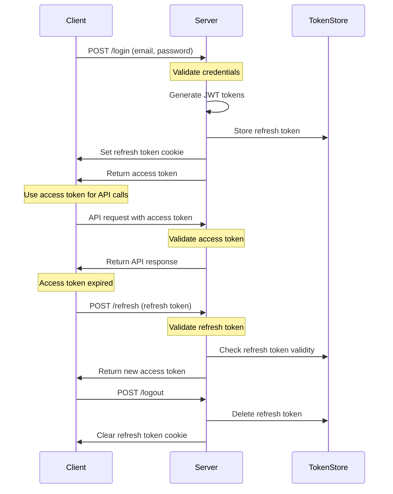
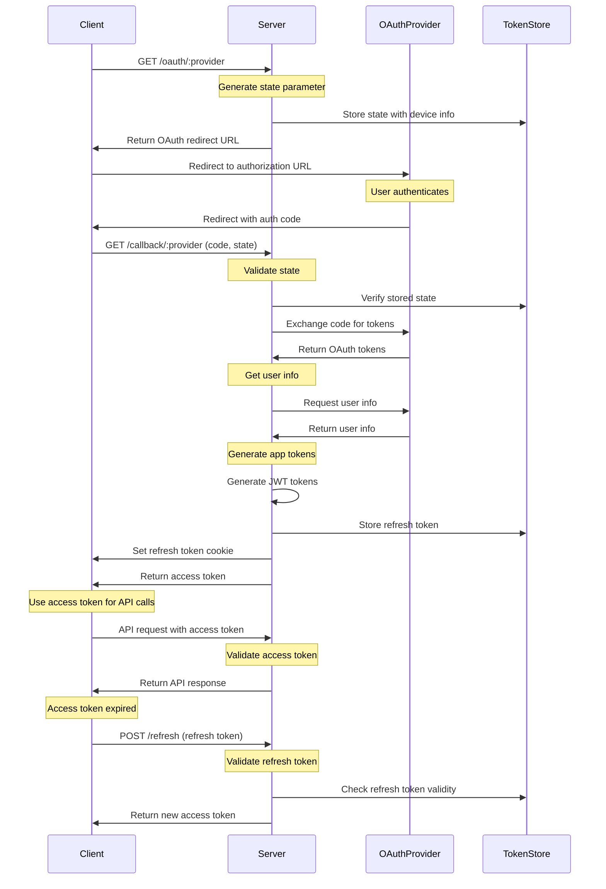

# System Architecture

Tech stack, folder structure, testing frameworks.

## Technology Stack

### Backend

- **Runtime**: Node.js with Express framework
- **Language**: TypeScript for type safety
- **JWT Library**: `jsonwebtoken` v9.0.2
- **Testing**: Jest for unit testing
- **Linting**: ESLint with TypeScript support

### Frontend

- **Framework**: React 18 with TypeScript
- **Build Tool**: Vite for fast development and building
- **Styling**: Tailwind CSS for utility-first styling
- **HTTP Client**: Fetch API with custom interceptors

### OAuth Server

- **Purpose**: Mock OAuth provider for demonstration
- **Implementation**: Express server with EJS templating
- **Providers**: Google, Microsoft, Strava, Company (mock implementations)

### Integration Testing

- **Framework**: Playwright for end-to-end testing
- **Coverage**: OAuth flows, token invalidation, session management

## JWT Authentication Architecture

### Token Types and Lifecycle

```
┌─────────────────┐    ┌─────────────────┐    ┌──────────────────┐
│   Access Token  │    │  Refresh Token  │    │    ID Token      │
│                 │    │                 │    │   (OAuth only)   │
│ • 15 seconds    │    │ • 7 days        │    │ • 15 seconds     │
│ • API access    │    │ • Single-use    │    │ • Identity info  │
│ • In memory     │    │ • HTTP cookie   │    │ • Nonce verified │
└─────────────────┘    └─────────────────┘    └──────────────────┘
```

### Security Features

1. **Token Rotation**: Single-use refresh tokens with automatic rotation
2. **Device Tracking**: Session management per device with unique identifiers
3. **Token Blacklisting**: Immediate token revocation capability
4. **Algorithm Specification**: Explicit HMAC-SHA256 validation
5. **Audience Validation**: Proper token audience claims and verification
6. **Secure Storage**: HTTP-only cookies for refresh tokens

### Authentication Flows

## Password-Based Authentication Flow

1. **User Login**
   - User provides credentials
   - Client generates unique device ID and includes it in request header:
     ```
     X-Device-Id: <unique_device_id>
     ```
   - Server generates:
     - Short-lived access token (15 seconds) with enhanced claims
     - Long-lived refresh token (7 days) with similar claims but restricted scope
   - Refresh token stored in HTTP-only cookie
   - Access token returned to client
   - Each refresh token represents a virtual session for that device

2. **Token Refresh Flow**
   - Client detects access token expiration
   - Client sends refresh token in HTTP-only cookie
   - Server validates refresh token:
     - Verifies JWT signature
     - Checks token is not revoked or used
     - Validates device ID
   - Server generates new tokens:
     - New access token
     - New refresh token (single-use)
   - Server marks old refresh token as used
   - Server stores new refresh token
   - Server sets new refresh token in HTTP-only cookie
   - Server returns new access token

3. **Access Token Usage**
   - Client stores access token in memory (not localStorage)
   - Access token included in Authorization header for all protected API requests:
     ```
     Authorization: Bearer <access_token>
     ```
   - Server validates access token on each request
   - If token is invalid or expired, client receives 401 response
   - Client-side interceptor handles token refresh on 401 responses

4. **Session Management**
   - Virtual sessions are maintained through a chain of single-use refresh tokens
   - Each session is identified by a device ID and persists through token rotation
   - User can view active sessions by listing devices with valid token chains
   - User can revoke specific sessions by invalidating all tokens for a device
   - System automatically cleans up expired tokens
   - System tracks device information for each token chain
   - No traditional server-side session storage is used

## OAuth Authentication Flow

The application implements OAuth 2.0 Authorization Code Flow with OpenID Connect for identity verification.

1. **Authorization Request**
   - Client generates:
     - State parameter (CSRF protection)
     - Nonce (replay attack prevention)
   - User redirected to provider's authorization endpoint with:
     - `response_type=code`
     - `client_id`
     - `redirect_uri`
     - `scope`
     - `state`
     - `nonce`
     - `provider`

2. **Authorization Code Exchange**
   - Provider redirects back with:
     - Authorization code
     - State parameter
   - Client exchanges code for tokens using:
     - Authorization code
     - Client credentials
     - Redirect URI

3. **Token Management**
   - Access tokens (15 seconds for demo)
     - Used for API access
     - Contains minimal claims (sub, provider)
   - Refresh tokens (7 days lifetime)
     - Used for obtaining new access tokens
     - Contains minimal claims (sub, provider)
   - ID tokens (15 seconds for demo)
     - Contains identity information
     - Includes nonce for replay attack prevention
     - Standard OpenID Connect claims:
       - `iss` (Issuer)
       - `sub` (Subject)
       - `aud` (Audience)
       - `exp` (Expiration)
       - `iat` (Issued At)
       - `nonce` (Nonce)
   - Secure storage in HTTP-only cookies
   - Automatic token refresh before expiration

4. **Provider-Specific Scopes**
   - Google/Microsoft/Company: `openid`, `profile`, `email`
   - Strava: `read`, `activity:read`

## Authentication Flow Diagrams

### Password-Based Authentication Flow



### OAuth-Based Authentication Flow



## Security Features

### OAuth Security Features
- State parameter for CSRF protection
- Nonce in ID token for replay attack prevention
- HTTP-only cookies for token storage
- SameSite=strict cookie attributes
- Secure token transmission
- Provider-specific client validation
- Automatic cleanup of expired authorization codes

### General Security Measures
- **Access Tokens**
  - Short-lived (15 seconds for demo)
  - Stored in memory
  - Can be blacklisted if compromised
  - Proactively refreshed to prevent expiration during use

- **Refresh Tokens**
  - Long-lived (7 days)
  - Stored in HTTP-only cookies
  - Device-specific
  - Automatically expire

- **ID Tokens** (OAuth only)
  - Standard lifetime (1 hour)
  - Contains identity information
  - Includes nonce for replay attack prevention
  - Standard OpenID Connect claims
  - Used for identity verification during OAuth flow

- **Cookies**
  - HTTP-only (prevents XSS)
  - SameSite=strict (prevents CSRF)
  - Secure in production

## Enhanced JWT Claims

All JWT tokens include enhanced claims for improved security:

- `iss` (Issuer): Identifies the application
- `sub` (Subject): User ID in standard JWT format
- `aud` (Audience): Specifies authorized services
- `jti` (JWT ID): Unique token identifier to prevent replay attacks
- `scope`: Defines token permissions (read/write for access token, refresh for refresh token)
- `version`: Handles token format changes
- `deviceId`: Tracks device-specific tokens

## Token Management Features

- **Proactive Token Refresh System**:
  - Checks token expiration every minute
  - Refreshes tokens 5 minutes before expiration
  - Prevents race conditions from multiple simultaneous refresh attempts
  - Ensures smooth user experience without token expiration interruptions

- **Single-use Refresh Tokens**: Enhanced security through token rotation
- **Token Blacklisting**: Immediate invalidation support
- **Device Tracking**: Each device gets unique token chains
- **Automatic Cleanup**: Expired tokens are automatically removed

## Project Structure & Setup

### Project Architecture

This is a comprehensive JWT authentication demo featuring a multi-service architecture:

- **Backend (port 3001)**: Node.js/Express API server with JWT authentication
- **Frontend (port 5173)**: React/Vite SPA with TypeScript  
- **OAuth Server (port 3002)**: Fake OAuth server for testing OAuth flows
- **Integration Tests**: Playwright-based E2E tests

### Directory Structure

```
.
├── backend/                   # Node.js Express API Server
│   ├── src/
│   │   ├── routes/           # API route handlers
│   │   │   ├── auth.js       # Authentication endpoints
│   │   │   ├── customers.js  # Customer data endpoints  
│   │   │   ├── sessions.js   # Session management
│   │   │   └── users.js      # User profile endpoints
│   │   ├── middleware/       # Express middleware
│   │   │   └── auth.js       # JWT validation middleware
│   │   ├── stores/           # In-memory data stores
│   │   │   ├── refreshTokenStore.js    # Refresh token storage
│   │   │   ├── tokenBlacklistStore.js  # Token blacklist
│   │   │   └── nonceStore.js           # Nonce validation
│   │   ├── services/         # Business logic services
│   │   │   ├── tokenCleanupService.js  # Token cleanup
│   │   │   └── oauthService.js         # OAuth utilities
│   │   ├── utils/            # Utility functions
│   │   │   ├── jwt.js        # JWT creation/validation
│   │   │   ├── cookies.js    # Cookie management
│   │   │   └── oauth.js      # OAuth helpers
│   │   └── server.js         # Express server setup
│   ├── .env                  # Environment variables
│   └── package.json          # Backend dependencies
│
├── frontend/                  # React Frontend Application
│   ├── src/
│   │   ├── api/              # API client and services
│   │   │   ├── client.js     # Axios configuration
│   │   │   ├── auth.js       # Auth API calls
│   │   │   └── interceptors.js # Token refresh interceptors
│   │   ├── components/       # React components
│   │   │   ├── auth/         # Authentication components
│   │   │   │   ├── LoginForm.tsx
│   │   │   │   ├── OAuthLogin.tsx
│   │   │   │   └── SessionsList.tsx
│   │   │   ├── layout/       # Layout components
│   │   │   │   ├── Header.tsx
│   │   │   │   └── Navigation.tsx
│   │   │   └── ui/           # Reusable UI components
│   │   ├── context/          # React Context providers
│   │   │   └── AuthContext.tsx # Authentication state
│   │   ├── hooks/            # Custom React hooks
│   │   │   └── useAuth.tsx   # Authentication hook
│   │   ├── pages/            # Page components
│   │   │   ├── LoginPage.tsx
│   │   │   ├── DashboardPage.tsx
│   │   │   └── AccountPage.tsx
│   │   ├── services/         # Frontend services
│   │   │   ├── tokenRefresh.js # Token refresh logic
│   │   │   └── oauthHandler.js # OAuth flow handling
│   │   ├── utils/            # Utility functions
│   │   │   └── deviceId.js   # Device ID generation
│   │   ├── App.tsx           # Main application component
│   │   └── main.tsx          # Application entry point
│   ├── public/               # Static assets
│   ├── index.html            # HTML template
│   └── package.json          # Frontend dependencies
│
├── oauth-server/              # Fake OAuth Server for Testing
│   ├── src/
│   │   ├── routes/           # OAuth route handlers
│   │   │   ├── authorize.js  # Authorization endpoints
│   │   │   ├── token.js      # Token exchange
│   │   │   └── userinfo.js   # User information
│   │   ├── config/           # OAuth configuration
│   │   │   ├── providers.js  # Provider configurations
│   │   │   └── clients.js    # Client registrations
│   │   ├── stores/           # OAuth data stores
│   │   │   ├── authorizationCodes.js # Authorization codes
│   │   │   └── tokens.js             # OAuth tokens
│   │   ├── utils/            # OAuth utilities
│   │   │   ├── jwt.js        # JWT creation for OAuth
│   │   │   └── providers.js  # Provider-specific logic
│   │   └── server.js         # OAuth server setup
│   ├── views/                # HTML templates
│   │   └── authorize.html    # Authorization consent page
│   ├── public/               # Static assets
│   └── package.json          # OAuth server dependencies
│
├── integration-tests/         # End-to-End Tests
│   ├── tests/                # Playwright test files
│   │   ├── auth.spec.js      # Authentication tests
│   │   ├── oauth.spec.js     # OAuth flow tests
│   │   └── sessions.spec.js  # Session management tests
│   ├── fixtures/             # Test fixtures
│   ├── playwright.config.js  # Playwright configuration
│   └── package.json          # Test dependencies
│
├── docs/                      # Documentation
│   ├── description.md        # App description and features
│   ├── architecture.md       # Technical architecture
│   ├── datamodel.md         # Data model and relationships
│   ├── frontend.md          # Frontend implementation
│   ├── backend.md           # Backend implementation
│   ├── debugging.md         # Debugging guide
│   ├── integration-tests.md # Integration testing guide
│   ├── todo.md              # Project tasks and status
│   ├── ai_changelog.md      # AI-generated changes log
│   └── learnings.md         # Technical learnings
│
├── README.md                 # Main project documentation
├── CLAUDE.md                # Claude Code instructions
└── package.json             # Root package.json with shared scripts
```

## Installation & Setup

### Prerequisites

- **Node.js**: Version 18 or higher
- **npm**: Version 8 or higher

### Quick Setup

1. **Clone and Install**
   ```bash
   git clone <repository-url>
   cd react-node-jwt-example
   npm run install:all
   ```

2. **Start All Services**
   ```bash
   npm run dev
   ```

3. **Access Application**
   - Frontend: http://localhost:5173
   - Backend API: http://localhost:3001/api
   - OAuth Server: http://localhost:3002

### Individual Service Setup

#### Backend Setup
```bash
cd backend
npm install
npm run dev        # Development with nodemon
npm run build      # TypeScript compilation
npm run start      # Production mode
```

#### Frontend Setup  
```bash
cd frontend
npm install
npm run dev        # Vite development server
npm run build      # Production build
npm run preview    # Preview production build
```

#### OAuth Server Setup
```bash
cd oauth-server
npm install
npm run dev        # Development with nodemon
npm run build      # Build with asset copying
npm run start      # Production mode
```

#### Integration Tests Setup
```bash
cd integration-tests
npm install
npm run install-deps  # Install Playwright browsers
npm test             # Run all tests
npm run test:ui      # Run with UI
npm run test:debug   # Run with debugging
```

## Environment Configuration

### Backend Environment (.env)
```env
PORT=3001
JWT_ACCESS_SECRET=your_access_secret
JWT_REFRESH_SECRET=your_refresh_secret
ACCESS_TOKEN_EXPIRY=15         # 15 seconds for demo
REFRESH_TOKEN_EXPIRY=604800    # 7 days in seconds
NODE_ENV=development
```

### OAuth Server Environment
```env
PORT=3002
JWT_SECRET=fake-oauth-secret
ACCESS_TOKEN_EXPIRY=3600       # 1 hour in seconds
REFRESH_TOKEN_EXPIRY=604800    # 7 days in seconds

# OAuth Provider Configuration (optional - defaults provided)
GOOGLE_CLIENT_ID=fake-google-client-id
GOOGLE_CLIENT_SECRET=fake-google-client-secret
MICROSOFT_CLIENT_ID=fake-microsoft-client-id
MICROSOFT_CLIENT_SECRET=fake-microsoft-client-secret
STRAVA_CLIENT_ID=fake-strava-client-id
STRAVA_CLIENT_SECRET=fake-strava-client-secret
COMPANY_CLIENT_ID=fake-company-client-id
COMPANY_CLIENT_SECRET=fake-company-client-secret
```

## Development Workflow

### Available Scripts (Root Level)
```bash
npm run install:all       # Install all dependencies
npm run dev              # Start all services in development
npm run build            # Build all services
npm start                # Start all services in production
npm run test:integration # Run E2E tests
npm run clean            # Clean all node_modules and build artifacts
```

### Testing Strategy
- **Unit Tests**: Jest for backend business logic testing
- **Integration Tests**: Playwright for full-flow E2E testing
- **Manual Testing**: Demo user (demo/password123) for quick verification

### Code Quality
- **TypeScript**: Full TypeScript support in frontend
- **ESLint**: Code linting for consistency
- **Prettier**: Code formatting
- **Git Hooks**: Pre-commit hooks for code quality

## Security Considerations

### Development vs Production
- **Token Expiry**: Very short for demo (15 seconds), should be longer in production (15-30 minutes)
- **HTTP-Only Cookies**: Disabled in demo for debugging, should be enabled in production
- **HTTPS**: Required in production for secure cookie transmission
- **Secrets**: Use strong, random secrets in production environments

### Best Practices Implemented
- **No Secrets in Code**: All secrets configured through environment variables
- **Memory Storage**: Access tokens stored in memory, not localStorage
- **Token Rotation**: Single-use refresh tokens with automatic rotation
- **Device Tracking**: Unique device identification for session management
- **Automatic Cleanup**: Expired tokens are automatically removed

## Key Components

### Backend Components

#### Authentication Middleware (`middleware/auth.middleware.ts`)

- **verifyAccessToken**: Validates JWT access tokens for protected routes
- **verifyRefreshToken**: Validates and consumes single-use refresh tokens
- **Features**: Token blacklist checking, device validation, algorithm specification

#### Token Utilities (`utils/token.utils.ts`)

- **createToken**: Centralized JWT token creation with standard claims
- **commonVerifyOptions**: Shared JWT verification configuration
- **Benefits**: Consistency, maintainability, security

#### Token Stores

- **refreshToken.store.ts**: Device-specific refresh token management
- **tokenBlacklist.store.ts**: Revoked access token tracking
- **nonce.store.ts**: OAuth nonce validation for replay attack prevention

#### Routes

- **auth.routes.ts**: Password authentication, token refresh, logout
- **oauth.routes.ts**: OAuth provider integration and callbacks
- **user.routes.ts**: User management endpoints
- **session.routes.ts**: Session and device management

### Frontend Components

#### Authentication Context (`context/AuthContext.tsx`)

- Centralized authentication state management
- Automatic token refresh handling
- Login/logout functionality

#### Token Management (`services/tokenRefresh.ts`)

- Automatic access token refresh
- HTTP interceptor for 401 responses
- Proactive token renewal

#### OAuth Integration (`services/oauth.ts`)

- OAuth provider configuration
- State and nonce generation
- Redirect URL construction

### OAuth Server Components

#### Authorization Flow (`routes/authorize.routes.ts`)

- OAuth authorization endpoint
- Consent page rendering
- Authorization code generation

#### Token Exchange (`routes/token.routes.ts`)

- Authorization code validation
- JWT token generation (access, refresh, ID tokens)
- Proper audience claim implementation

#### User Info (`routes/userinfo.routes.ts`)

- Protected user profile endpoint
- Access token validation
- Mock user data serving

## Testing Frameworks

### Unit Testing (Jest)

- **Location**: `backend/tests/`
- **Coverage**: Authentication flows, token validation, middleware
- **Configuration**: `jest.config.js` with TypeScript support

### Integration Testing (Playwright)

- **Location**: `integration-tests/tests/`
- **Scenarios**:
  - Complete OAuth authentication flows
  - Token invalidation and session management
  - Cross-browser compatibility
- **Configuration**: `playwright.config.ts`

### Test Utilities

- **Mock Data**: Consistent test user accounts
- **Helper Functions**: Common test operations
- **Environment Setup**: Isolated test environments

## Security Architecture

### Defense in Depth

1. **Algorithm Specification**: Prevents JWT algorithm confusion attacks
2. **Token Rotation**: Single-use refresh tokens limit exposure window
3. **Device Tracking**: Session isolation and management
4. **Audience Validation**: Prevents cross-service token misuse
5. **Secure Cookies**: HTTP-only, SameSite protection
6. **Token Blacklisting**: Immediate revocation capability

### Threat Mitigation

- **XSS Protection**: HTTP-only cookies, token storage best practices
- **CSRF Protection**: SameSite cookies, state parameters
- **Replay Attacks**: Nonce validation, single-use tokens
- **Token Theft**: Short-lived access tokens, device binding
- **Algorithm Attacks**: Explicit algorithm specification
